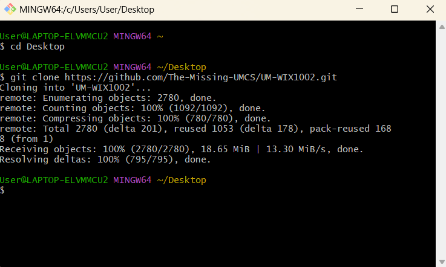
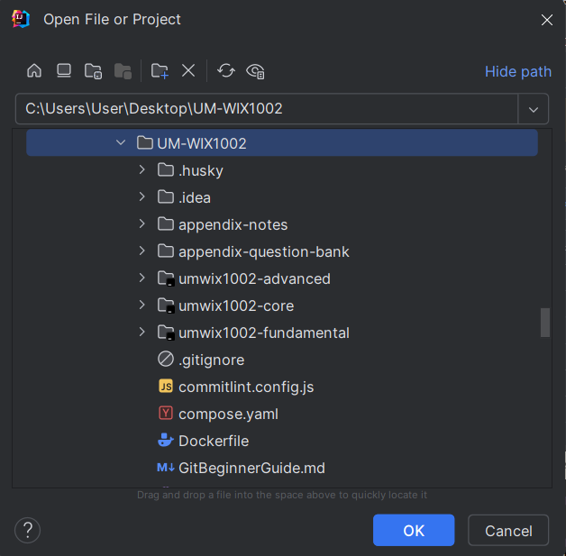

# 👋 Hi Juniors. Take a minute or two to read this.

Good day, juniors. I hope you’re doing well, and if WIX1002 Fundamental of Programming has been stressing you out, I hope this small message makes things feel a little lighter.

This repository gathers everything I’ve learned while surviving — and eventually loving — this course. You’ll find notes, questions, source code, and detailed explanations (if anyone requests for it XD) for Tutorials and Labs (UM-WIX1002). Think of it as a toolbox built by someone who walked the same path you’re on now, someone who remembers how confusing the early weeks felt.

If you find this repository helpful, give it a star. If you want to add your own improvements, feel free to create a pull request. And if anything doesn’t work or leaves you stuck, reach out to me on WhatsApp (Ng Zhi Yang, 017-7809292). I’ll help however I can.

The guideline to use this repository: [2. A Brief Guideline to This Repository](https://github.com/The-Missing-UMCS/UM-WIX1002/tree/main?tab=readme-ov-file#2-a-brief-guideline-to-this-repository)

## 1. My Journey with FOP

### 1.1. Year 1 (Last updated: 17/12/2022)

December 2022 was one of the most challenging times in my programming journey. I lost every single Lab and Tutorial file in Eclipse. I realized this devastating loss on 14/12/2022, and it hit me hard because I had no backups. The only silver lining was the few files I had pushed to GitHub/GitLab (Lab1 to Lab6).

The lab questions were tough—brutally tough. Problem Solving 3 was no exception. It took me over 12 hours to redo everything, but by 17/12/2022, I had finally completed it all. That moment was filled with relief and pride.

One key takeaway from this ordeal: **NEVER GIVE UP.** Programming isn’t about getting it right the first time. It’s normal to spend 30 minutes, an hour, or even an entire day wrestling with one question. I remember spending two hours debugging and modifying `L10Q4.java`.

I tried using `LinkedBlockingQueue` and `PriorityQueue` in `L10Q4.java` to maintain appointments in ascending order. But it didn’t work because:

> "The Iterator provided in method iterator() is not guaranteed to traverse the elements of the priority queue in any particular order." — *Java Documentation*

It took countless attempts and over three hours to figure this out. While it was frustrating, it taught me resilience and the importance of understanding the tools I use.

Here are some tips that helped me through:

1. Explore [StackOverflow](https://stackoverflow.com/). You can find answers to almost anything there.
2. Use [Google](https://www.google.com/) extensively. It’s often more powerful than you realize.
3. Ask questions on [ChatGPT](https://openai.com/blog/chatgpt/). While incredibly helpful, don’t over-rely on it or let AI limit your creativity.
4. Read others’ code on [GitHub](https://github.com/) or [GitLab](https://gitlab.com/). As programmers, we learn by reading.
5. Dive into the [Java Documentation](https://docs.oracle.com/javase/7/docs/api/). It’s an invaluable resource.
6. Don’t hesitate to seek advice from peers, mentors, or friends who excel at programming.

If you’re ever struggling, remember that it’s part of the process. Feel free to reach out to me at 017-780 9298 (WhatsApp/Telegram). You’re not alone, and you’ve got this. Good luck!

### 1.2. Year 3 (Last updated: 15/1/2025)

Looking back, I didn’t update this repository during Year 2 because I was overwhelmed with responsibilities as the Head of Department for an event. It was only in Year 3, during my internship, that I returned to this code. Revisiting Java during my internship reignited my passion for programming. I began to explore clean code, design patterns, and best practices, and I fell in love with the elegance of well-written code.

Books like *Clean Code* and *The Art of Readable Code* changed the way I thought about programming. I became obsessed with refining my skills, and thankfully, my company encouraged this growth. I learned about Java Streams and used them extensively in my work, especially in the PastYear and umwix1002-advanced sections. Streams made my code more concise, readable, and powerful—I genuinely love them.

    

When I revisited my FOP code, I was shocked. It was messy, unorganized, and in desperate need of a makeover. I spent time refactoring everything, adding meaningful test cases and comments. It wasn’t easy, but the results were deeply satisfying.

This journey has taught me so much. Not just about Java, but about the art of clean, readable, and efficient code. I’ve learned to appreciate the beauty of thoughtful design and the impact it can have on your work and mindset.

For newcomers: You may encounter unfamiliar syntax like List, Set, Map, Stream, and Optional. Don’t let it intimidate you. With tools like ChatGPT, learning these concepts is easier than ever. Master them now because they’ll become invaluable in your FOP and Data Structure assignments (and later in your career).

Remember, every great programmer started where you are now. Keep learning, experimenting, and growing. If you have questions, I’m always here to help at 017-780 9298 (WhatsApp/Telegram).

Oh, I’ve been using commitlint to standardize my commit messages. To try it out, install Node.js, run npm i to install dependencies, and give it a shot.

Good luck. You are amazing, and your journey is just beginning.

### 1.3.4. Year 4 (Last Updated: 23 November 2025)

#### 1.3.4.1 Throw Back I: Why I'm creating this repository?

Time moves quietly, relentlessly, and almost imperceptibly, until one day you look back and realise just how far you've walked. It has been years since I first created this repository, and now, my heart swells with the feeling too complex to name. There is a soft ache in nostalgia, a gentle heaviness that rises when you finally bid farewell to something you’ve tended with curiosity, stubborn hope, and the patience of countless seasons. You watch it grow alongside you, and it becomes part of who you are.

I still remember building this repository as if it were a photograph suspended in time. It was an ordinary afternoon — or maybe a late night; those early semesters often blurred together — sometime in 2022. All I wanted was a place to practise Git and share my solutions. Nothing ambitious. Nothing grand. 

Little did I know it would become so much more.

Back in Year 1, mastering Git/GitHub felk like unlocking a secret door. Hardly anyone around me knew these tools, and with the innocence of freshman, that small technical edge made me feel strangely confident.

But as semesters unfolded, something shifted. I began noticing how many of my peers were struggling — not because they lacked potential, but because programming was so foreign to them. Some hadn't even chosen this path; the course had been assigned to them. And for many of us, FOP lab was brutal. Even now, as Year 4 student, I still believe that if I were to rewind back to Year 1 with today's mindset, FOP would feel like a mountain.

There was no ChatGPT in 2022. No instant explanation. No fallback.

What began as a personal exercise slowly transformed into something more compassionate—a small gesture to ease someone else’s struggle. And when I realised that even one person might benefit from what I posted, the pride I felt was genuine and unexpectedly meaningful. I wasn’t just coding anymore; I was helping.

A few friends later created their own repositories too. We studied each other's code, borrowed ideas, built on one another's logic. Looking back, those moments feel warm. A quite, little community forged not by formality, but by shared curiosity and youthful enthusiasm.

#### 1.3.4.2 What Makes Me Revisit This Repository

If you've read Section 5.2.3, you might already sense the reasons pulling me back. I once thought refining everything would be easy, perhaps with a few touch-ups, some restructuring, maybe a weekend or two of work. But refactoring, as always, revealed itself to be harder than expected. Life moved faster than my plans: academic pressure, personal development, internship tasks, and the weight of the final-year project all collided at once.

But what drained me the most wasn't the workload.

It was the silence. 

Lu Xun once said:
"Praise motivates. Criticism sharpens. But silence makes one feel invisible."

It felt as though the repository I had poured myself into had quietly slipped into the background, unseen and unappreciated. So I let go. I told myself the repository had served its purpose and quietly stepped away.

But life has its own timing. 

In my final semester, I became a demonstrator, my last role in the long journey of university life. Suddenly, I was face-to-face with freshies again: bright-eyed, uncertain, stumbling through code the same way I once did. There is a tenderness in recognising your past self in someone else. Their struggle awakened something in me — a desire to reach back, to guide, to protect.

That’s how [_A Short Note: Git and GitHub_](https://docs.google.com/document/d/1g_zROSlt2mc738iPzJfkGzWkmVsknNKrGwOrTkMnobo/edit?usp=sharing) and [_A Git Crash Course_](https://docs.google.com/document/d/15lfIJgp8tAXFdQxJqnmksdpyHrUulR67KpcWqwX3vUg/edit?usp=sharing) came to life. Not out of obligation, but out of care. I spend more than five hours writing the those manuals. I stayed in the lab until 7:00 p.m. just to teach them Git and GitHub. I wanted them to feel seen, not stranded.

And somewhere along the way, I realised something quietly beautiful: my old repository was no longer forgotten. They were using it quietly, in ways I never imagined. They might never star it or comment, but they returned to it when they needed help. And that, silent reliance reminded me that my work still mattered.

In truth, I couldn't persuade myself to abandon the effort I had poured into this place. This repository grew with me through years and seasons, through triumphs and heartbreaks. and over those up and down. It knows how many hours I’ve spent on it—days, nights, entire evenings that slipped quietly away. And can I truly give it up? No. I admitted to myself: I must watch it grow and graduate, just as I have. I cannot break the promise I made to the younger version of me. He would never forgive me if I did.

Refactoring became easier once I found that purpose again. I realised how my earlier solutions had grown too advanced—filled with enums, Arrays.stream(), and Optional. Elegant, yes, but unkind to beginners. Splitting the repository into submodules only made navigation harder. So I rebuilt the entire experience: one unified repository, with multiple solutions for every question—from foundational to advanced. For Lab07 Question 5, for example, I included six solutions: from a simple array (l7q5a), to a matrix-based approach (l7q5b), all the way to a Stream-based solution (l7q5f). For anyone wanting to deepen their understanding of Java or functional programming, I prepared a gentle staircase—not a cliff.

To simplify further, I removed unnecessary tools like Husky and Docker. Beginners didn’t need noise. They needed clarity. This repository was never meant to show off industry-grade pipelines; it was meant to teach fundamentals.

Simpler is better.
Less is more.
Clarity over complexity.
Warmth over technical bravado.

### 1.3.4.3. It Comes to An End

There’s a saying in Chinese: “Everything eventually reaches its end.”  Everything, no matter how precious, eventually reaches its end. So it is with my journey with FOP. 

From here on, I will only maintain the repository lightly, perhaps adding FOP Final 2025/2026 solutions. After graduation, life will pull me toward new roads, new uncertainties, new beginnings. I may not look back as often as I once did. That's the nature of growth — we must sometimes leave behind the things we've built to make room for what comes next.

But I won’t archive this. Some things deserve to stay open, even if the world moves on. This repository is a small piece of who I was —— the hopeful Year 1 student, the tired Year 3 intern, the passionate Year 4 demonstrator. It carries my youth, my mistakes, my growth, and the quiet ways I once tried to help others. It carries memories of who I was, who I became, and the people I crossed paths with along the way.

And I want it to live on —— breathing, evolving —— even without me at the helm. I want it to remain a place where new contributors can continue the story I began. May it continue, with new hearts and new hands, long after my chapter closes. My hope is simple: that this repository becomes a resource for future batches long after I have left. That it grows beyond my hands. That it becomes a lighthouse for anyone who feels lost or uncertain. 

That is why I begin this chapter with my story.

Because if you are reading this, chances are you’ve struggled too.
And if you feel the same spark — the desire to help someone you may never meet — then this repository is waiting for you.

Leave a comment. Fork it. Send a pull request.
I will always welcome you here.

Because learning is never meant to be a lonely journey.
And neither is this repository.

## 2. A Brief Guideline to This Repository

### 2.1. Navigation

These links take you directly to what you need:

- **Lab**: [umwix1002-solutions/lab/](https://github.com/The-Missing-UMCS/UM-WIX1002/tree/main/umwix1002-solutions/src/main/java/com/umwix1002/solution/lab)
- **Tutorials**: [umwix1002-solutions/tutorial/](https://github.com/The-Missing-UMCS/UM-WIX1002/tree/refactor/umwix1002-core/src/main/java/com/umwix1002/solution/tutorial)
- **Problem-solving**: [umwix1002-solutions/problemsolving/](https://github.com/The-Missing-UMCS/UM-WIX1002/tree/refactor/umwix1002-core/src/main/java/com/umwix1002/solution/problemsolving)
- **Viva**: [umwix1002-solutions/viva/](https://github.com/The-Missing-UMCS/UM-WIX1002/tree/main/umwix1002-solutions/src/main/java/com/umwix1002/solution/viva)
- **Past years**: [umwix1002-solutions/pastyear/](https://github.com/The-Missing-UMCS/UM-WIX1002/tree/main/umwix1002-solutions/src/main/java/com/umwix1002/solution/pastyear).

### 2.2. Using IntelliJ

This repository is optimised for IntelliJ. Everything should run without extra setup.
If you’re using Eclipse, VSCode, Sublime Text, NetBeans, or anything else, you may need to adjust a few things.

**How to run the code**:
1. Clone the repository to your chosen folder.
   
   
2. Open IntelliJ and click on Open or Import.
   
3. Select any code to run. Create a Pull Request (PR) if you find any errors when running the code. All code is designed to be self-contained, meaning it should run independently without dependencies.

### 2.3. Questions

Many questions come with multiple solutions. The simplest version, using only basic methods or minimal Java features, is labelled a. Versions b, c, d, and so on gradually become more advanced.

Take your time. Explore. Choose whichever version makes sense to you.

## 3. Contribution

### 3.1. Forking the Repo

To access this repository offline or contribute, fork it. Forking allows you to add functionality, simplify code, or create test units. Learn more in the [Fork a Repo guide](https://docs.github.com/en/pull-requests/collaborating-with-pull-requests/working-with-forks/fork-a-repo).

### 3.2. Star the Repo

Don’t forget to star this repository to receive updates. Updates may include code simplification, additional comments, or new self-written notes for clarity. Starring the repo is also a simple way to show your appreciation and support.

### 3.3. Contribution

If you want to contribute, create a pull request. Refer to these GitHub guides for help:

* [**About Pull Requests in GitHub**](https://docs.github.com/en/pull-requests/collaborating-with-pull-requests/proposing-changes-to-your-work-with-pull-requests/about-pull-requests)
* [**Creating Pull Requests**](https://docs.github.com/en/pull-requests/collaborating-with-pull-requests/proposing-changes-to-your-work-with-pull-requests/creating-a-pull-request)

## 4. References

- <https://github.com/LimJY03/WIX1002_UM>
- <https://github.com/fyiernzy/UM-WIX1002>
- <https://github.com/chenghui-lee/WIX1002-Past-Year>
- <https://github.com/y33-j3T/WIX1002-Fundamentals-of-Programming>