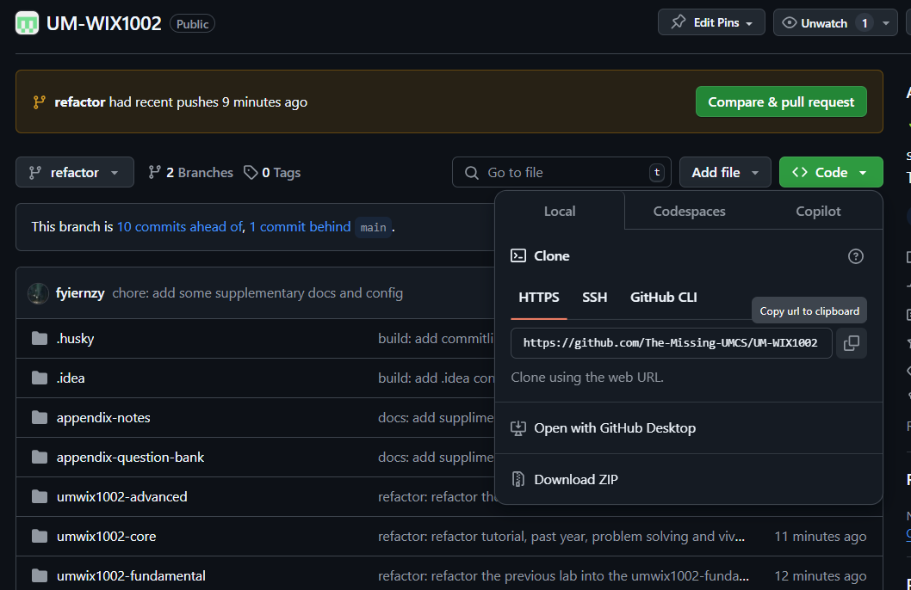

# ⚠️ Must-Read: Don’t Miss Out or You’ll Regret It!

This repository contains a range of study materials for the WIX1002 (Data Structure) course.

WIX1002 is offered by the Faculty of Computer Science and Information Technology (FCSIT) at the Universiti Malaya (UM) in Malaysia. Here, you will find notes, questions, source code, and detailed explanations for Tutorials and Labs (UM-WIX1002) that accompany the course.

Feel free to browse the materials and use them to supplement your learning. Hopefully, you find this repository helpful and informative. If you have any questions or suggestions, don’t hesitate to reach out to me.

## 1. Navigation

- **Basic lab solutions**: [umwix1002-fundamental-solution](https://github.com/The-Missing-UMCS/UM-WIX1002/tree/refactor/umwix1002-fundamental/src/main/java/com/umwix1002/solution/lab)
- **Advanced lab solutions**: [umwix1002-advanced-solution](https://github.com/The-Missing-UMCS/UM-WIX1002/tree/refactor/umwix1002-advanced/src/main/java/com/umwix1002/solution/lab)
- **Tutorials**: [umwix1002-core-tutorial](https://github.com/The-Missing-UMCS/UM-WIX1002/tree/refactor/umwix1002-core/src/main/java/com/umwix1002/solution/tutorial)
- **Problem-solving**: [umwix1002-core-problem-solving](https://github.com/The-Missing-UMCS/UM-WIX1002/tree/refactor/umwix1002-core/src/main/java/com/umwix1002/solution/problemsolving)
- **Viva**: [umwix1002-core-viva](https://github.com/The-Missing-UMCS/UM-WIX1002/tree/refactor/umwix1002-core/src/main/java/com/umwix1002/solution/viva)
- **Past years**: [umwix1002-core-past-year](https://github.com/The-Missing-UMCS/UM-WIX1002/tree/refactor/umwix1002-core/src/main/java/com/umwix1002/solution/pastyear). The past year solutions have covered all solutions from 2016 till 2024.

## 2. Using IntelliJ

This repository is optimized for IntelliJ, so you can run all the code without extra configuration. If you’re using Eclipse, VSCode, Sublime Text, NetBeans, or other IDEs, you might need to refactor the code to make it compatible. However, I recommend IntelliJ as it’s the best IDE for Java. Use NetBeans only for exams, not for learning or developing assignments.

### How to Run the Code in IntelliJ

1. Clone the repository to your desired location.

2. Open IntelliJ and click on Open or Import.

3. Select any code to run. Create a Pull Request (PR) if you find any errors when running the code. All code is designed to be self-contained, meaning it should run independently without dependencies.

## 3. Useful Resources

- **[💻 Oracle - Java](https://docs.oracle.com/javase/tutorial/)**  
  My go-to reference for understanding Java methods and their precise usage. The official documentation is comprehensive and an essential resource for Java developers.

- **[🤖 ChatGPT](https://openai.com/blog/chatgpt/)**  
  An incredibly helpful tool for refactoring code and learning new problem-solving techniques. However, always validate its suggestions and don’t let it limit your creativity.

- **[📚 StackOverflow](https://stackoverflow.com/)**  
  A reliable resource I frequently used before ChatGPT. It still serves as a great platform to find answers to specific programming challenges.

- **[🔥 GitHub](https://github.com/)**  
  A treasure trove of references and solutions. While many repositories offer useful insights, this repository strives to be the most comprehensive.

## 4. Git Command

Here are some useful Git commands:

- `git clone <url>`: Clone a repository into a new directory
- `git add <file/folder>`: Add a change in the working directory to staging area
- `git add .`: Add all changes to staging area
- `git commit -m "message"`: Record changes to the repository
- `git push origin <branch>`: Push changes to the remote repository
- `git status`: Displays the state of the working directory and the staging area.

For more information, watch Lecture 6: Version Control (Git) from MIT’s Missing Semester Course or read Pro Git. [ChatGPT](https://chatgpt.com/) can also be a quick reference.

## 5. My Journey with FOP

### 5.1. Year 1 (Last updated: 17/12/2022)

December 2022 was one of the most challenging times in my programming journey. I lost every single Lab and Tutorial file in Eclipse. I realized this devastating loss on 14/12/2022, and it hit me hard because I had no backups. The only silver lining was the few files I had pushed to GitHub/GitLab (Lab1 to Lab6).

The lab questions were tough—brutally tough. Problem Solving 3 was no exception. It took me over 12 hours to redo everything, but by 17/12/2022, I had finally completed it all. That moment was filled with relief and pride.

One key takeaway from this ordeal: **NEVER GIVE UP.** Programming isn’t about getting it right the first time. It’s normal to spend 30 minutes, an hour, or even an entire day wrestling with one question. I remember spending two hours debugging and modifying `L10Q4.java`.

I tried using `LinkedBlockingQueue` and `PriorityQueue` in `L10Q4.java` to maintain appointments in ascending order. But it didn’t work because:

> "The Iterator provided in method iterator() is not guaranteed to traverse the elements of the priority queue in any particular order." — *Java Documentation*

It took countless attempts and over three hours to figure this out. While it was frustrating, it taught me resilience and the importance of understanding the tools I use.

Here are some tips that helped me through:

1. Explore [StackOverflow](https://stackoverflow.com/). You can find answers to almost anything there.
2. Use [Google](https://www.google.com/) extensively. It’s often more powerful than you realize.
3. Ask questions on [ChatGPT](https://openai.com/blog/chatgpt/). While incredibly helpful, don’t over-rely on it or let AI limit your creativity.
4. Read others’ code on [GitHub](https://github.com/) or [GitLab](https://gitlab.com/). As programmers, we learn by reading.
5. Dive into the [Java Documentation](https://docs.oracle.com/javase/7/docs/api/). It’s an invaluable resource.
6. Don’t hesitate to seek advice from peers, mentors, or friends who excel at programming.

If you’re ever struggling, remember that it’s part of the process. Feel free to reach out to me at 017-780 9298 (WhatsApp/Telegram). You’re not alone, and you’ve got this. Good luck!

### 5.3. Year 3 (Last updated: 15/1/2025)

Looking back, I didn’t update this repository during Year 2 because I was overwhelmed with responsibilities as the Head of Department for an event. It was only in Year 3, during my internship, that I returned to this code. Revisiting Java during my internship reignited my passion for programming. I began to explore clean code, design patterns, and best practices, and I fell in love with the elegance of well-written code.

Books like *Clean Code* and *The Art of Readable Code* changed the way I thought about programming. I became obsessed with refining my skills, and thankfully, my company encouraged this growth. I learned about Java Streams and used them extensively in my work, especially in the PastYear and umwix1002-advanced sections. Streams made my code more concise, readable, and powerful—I genuinely love them.

    

When I revisited my FOP code, I was shocked. It was messy, unorganized, and in desperate need of a makeover. I spent time refactoring everything, adding meaningful test cases and comments. It wasn’t easy, but the results were deeply satisfying.

This journey has taught me so much. Not just about Java, but about the art of clean, readable, and efficient code. I’ve learned to appreciate the beauty of thoughtful design and the impact it can have on your work and mindset.

For newcomers: You may encounter unfamiliar syntax like List, Set, Map, Stream, and Optional. Don’t let it intimidate you. With tools like ChatGPT, learning these concepts is easier than ever. Master them now because they’ll become invaluable in your FOP and Data Structure assignments (and later in your career).

Remember, every great programmer started where you are now. Keep learning, experimenting, and growing. If you have questions, I’m always here to help at 017-780 9298 (WhatsApp/Telegram).

Oh, I’ve been using commitlint to standardize my commit messages. To try it out, install Node.js, run npm i to install dependencies, and give it a shot.

Good luck. You are amazing, and your journey is just beginning.

## 6. Miscellaneous

### 6.1. Forking the Repo

To access this repository offline or contribute, fork it. Forking allows you to add functionality, simplify code, or create test units. Learn more in the [Fork a Repo guide](https://docs.github.com/en/pull-requests/collaborating-with-pull-requests/working-with-forks/fork-a-repo).

### 6.2. Star the Repo

Don’t forget to star this repository to receive updates. Updates may include code simplification, additional comments, or new self-written notes for clarity. Starring the repo is also a simple way to show your appreciation and support.

### 6.3. Contribution

If you want to contribute, create a pull request. Refer to these GitHub guides for help:

* [**About Pull Requests in GitHub**](https://docs.github.com/en/pull-requests/collaborating-with-pull-requests/proposing-changes-to-your-work-with-pull-requests/about-pull-requests)
* [**Creating Pull Requests**](https://docs.github.com/en/pull-requests/collaborating-with-pull-requests/proposing-changes-to-your-work-with-pull-requests/creating-a-pull-request)

## 7. References

- <https://github.com/LimJY03/WIX1002_UM>
- <https://github.com/fyiernzy/UM-WIX1002>
- <https://github.com/chenghui-lee/WIX1002-Past-Year>
- <https://github.com/y33-j3T/WIX1002-Fundamentals-of-Programming>